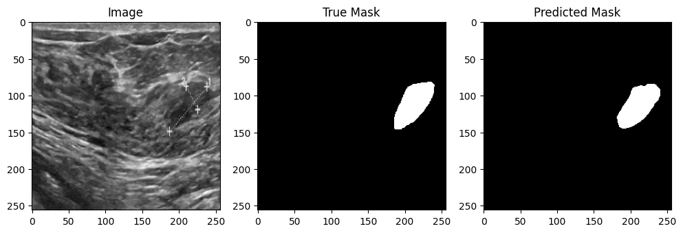
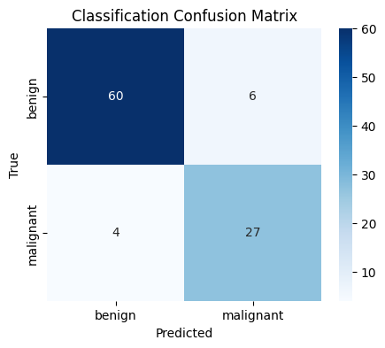

# Breast Tumor Detection & Classification (Ultrasound)

Full pipeline: tumor segmentation → detection → benign/malignant classification, using the BUSI ultrasound dataset.

## Approach
- **Segmentation**: U-Net (ResNet18 encoder, ImageNet pretrained) predicts tumor mask
- **Detection**: Bounding box extracted from predicted mask via OpenCV contours
- **Classification**: ResNet50 (transfer learning) classifies cropped tumor region as benign/malignant

## Dataset
[BUSI - Breast Ultrasound Images Dataset](https://www.kaggle.com/datasets/aryashah2k/breast-ultrasound-images-dataset) — 780 images, 3 classes (benign/malignant/normal), with ground-truth masks.

## Results
| Metric | Value |
|---|---|
| Segmentation Val Dice | 0.787 |
| Classification Accuracy | 90% |
| Classification F1-score | 0.844 |
| Pipeline Tumor Detection Rate | 94.8% |

## Sample Prediction

## Confusion Matrix

## How to Run
1. Open `busi_unet_resnet_pipeline.ipynb` in Google Colab
2. Add your own Kaggle API token
3. Run cells top to bottom (GPU runtime recommended)
